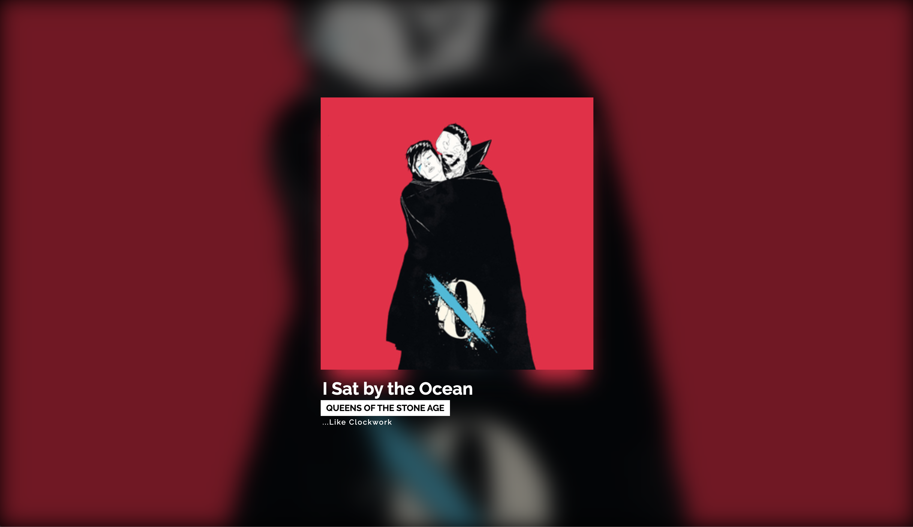

# Last.fm to MQTT

I'm building a photo-display that will show photos and album art. For that reason I needed to extract album art from what I'm playing. Since there is multiple sources this could be gathered from Last.fm is joining these sources together.

This projects pulls recent tracks from [Last.fm](https://last.fm) and distributes it to MQTT and WebSocket. A small browser app to show what's playing now.


Preview of browser app.

## Usage

```sh
yarn install
cp .env.example .env
```

Create a api account on [Last.fm](https://www.last.fm/api/account/create) and update `.env` with the newly created api-key.

Change MQTT credentials in `.env`.

Run application

```sh
yarn watch
cd dist
node main.js
```
